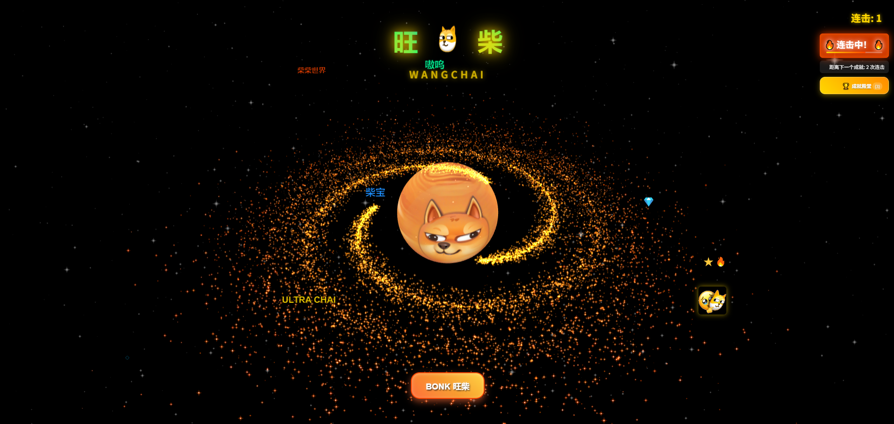
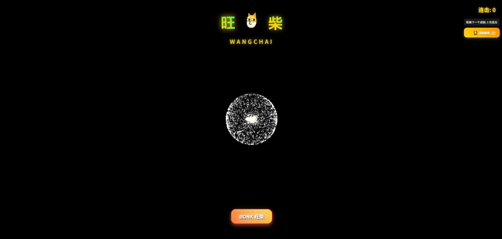
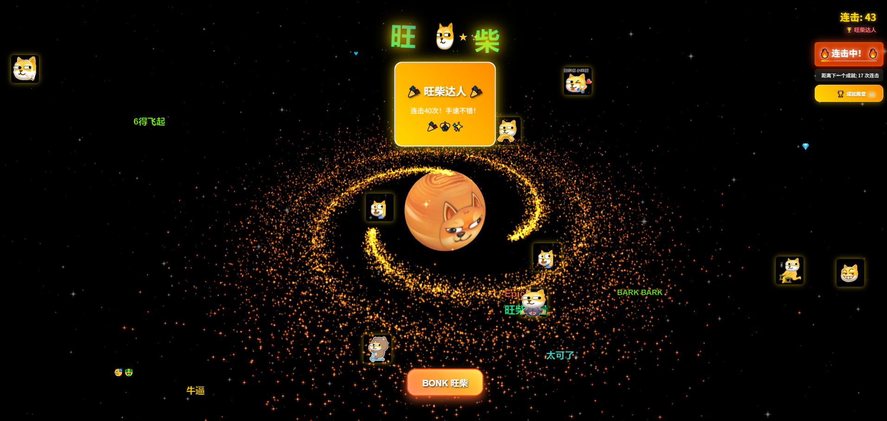

# 🚀 旺柴星球 | WangChai Planet

[](https://opensource.org/licenses/MIT)
[](https://vuejs.org/)
[](https://threejs.org/)
[](https://vitejs.dev/)
[](https://explorer.solana.com/address/wSoLvQQk125cGFMt48FNTWopCqFSb8vYPV3Xam4znKt)

> 🌟 **喜欢这个项目？** 一键支持开发者继续创作！ 
> 
> **Solana 地址**: `wSoLvQQk125cGFMt48FNTWopCqFSb8vYPV3Xam4znKt` 
> 
> *每一份支持都是对开源精神的贡献！* ⚡

🌍 **旺柴星球** - 基于 Vue 3 + Three.js + Vite 构建的沉浸式3D互动点击游戏，专为娱乐设计。具有3D银河系背景、点击游戏、成就系统、社交分享等功能。

## 🎯 游戏介绍 | Game Introduction

### 🌌 沉浸式3D体验
旺柴星球将你带入一个绚烂的3D银河系世界，以旺柴星球为中心，周围环绕着璀璨的星系和动态粒子效果。游戏采用Three.js技术，呈现出令人惊叹的视觉效果。

### 🎮 简单而富有挑战的游戏机制
- **核心玩法**: 点击中央的旺柴星球进行连击
- **双重控制**: 既可以直接点击星球，也可以使用"BONK 旺柴"按钮
- **即时反馈**: 每次点击都有炫酷的动画效果和GIF弹出
- **失败机制**: 随着连击数增加，挑战难度逐步提升

### 🏆 丰富的成就系统
游戏设计了29级成就等级，从"旺柴萌新"(3击)到"旺柴创世神"(2000击)，每个等级都有独特的称号和奖励。同时还有10个失败成就，让游戏更具挑战性和趣味性。

### 📱 社交分享功能
- **个性化成就卡片**: 自动生成包含玩家姓名、成就等级的精美卡片
- **一键分享**: 支持下载分享图片，便于在社交媒体传播
- **成就历史**: 完整记录玩家的游戏历程和最高记录

> 💰 **项目盈利了？** 开发者也需要"旺柴"生活哦！`wSoLvQQk125cGFMt48FNTWopCqFSb8vYPV3Xam4znKt` 🐕

## 📸 游戏截图 | Screenshots

### 🌟 主界面 - 3D银河系背景

*绚烂的3D银河系背景，中央的旺柴星球等待你的点击*

### 🎬 开场动画 - 银河诞生

*震撼的开场动画，见证银河系的诞生过程*

### 🏆 成就系统 - 荣誉殿堂

*完整的成就系统，记录你的每一次突破*

## ⚠️ 重要免责声明 | Legal Disclaimer

**🔴 本项目仅为开源技术展示，作者不参与任何代币的开发、推广或交易活动。**

- 本代码库仅提供技术实现参考，不构成任何投资建议
- 作者对使用本代码产生的任何法律、财务或其他后果概不负责
- 任何代币相关的法律风险由使用者自行承担
- 请使用者遵守当地法律法规，合规使用本项目
- 本项目采用 MIT 开源协议，使用者需自行承担使用风险

**This project is for open-source technical demonstration only. The author does not participate in any token development, promotion, or trading activities. Users assume all legal and financial risks.**

## ✨ 功能特性 | Features

### 🎮 核心功能
- **3D银河系背景** - 基于Three.js的动态星系动画
- **互动点击游戏** - 旺柴星球点击连击系统
- **成就系统** - 29级成就等级（19个成功+10个失败）
- **社交分享** - 成就卡片生成与一键分享
- **弹幕效果** - 动态飘入文字系统
- **响应式设计** - 完美适配桌面端和移动端

### 🎯 技术特色
- Vue 3 组合式API架构
- Three.js 3D渲染引擎
- Canvas自定义分享卡片
- 本地存储成就数据
- 模块化配置系统
- 多语言支持框架

## 🛠️ 技术栈 | Tech Stack

- **前端框架**: Vue 3 (Composition API)
- **3D引擎**: Three.js r156
- **构建工具**: Vite 4.x
- **动画库**: @tweenjs/tween.js
- **样式**: 原生CSS + 响应式设计
- **存储**: LocalStorage

## 📋 系统要求 | Requirements

- Node.js >= 16.0.0
- npm >= 8.0.0 或 yarn >= 1.22.0
- 现代浏览器（支持ES6+、WebGL）

## 🚀 快速开始 | Quick Start

> 💡 **开发者提示**: 如果这个项目对你有帮助，欢迎支持开发者！
> 
> Solana 捐赠: `wSoLvQQk125cGFMt48FNTWopCqFSb8vYPV3Xam4znKt` ⭐

### 1. 克隆项目
```bash
git clone https://github.com/dev-crazy-Q/wangchai-planet.git
cd wangchai-planet
```

### 2. 安装依赖
```bash
npm install
# 或使用 yarn
yarn install
```

### 3. 开发环境运行
```bash
npm run dev
# 或使用 yarn
yarn dev
```
访问 `http://localhost:3000` 查看效果

### 4. 生产环境构建
```bash
npm run build
# 或使用 yarn
yarn build
```

### 5. 预览构建结果
```bash
npm run preview
# 或使用 yarn
yarn preview
```

🎉 **部署成功？** 别忘了支持一下开发者哦！ `wSoLvQQk125cGFMt48FNTWopCqFSb8vYPV3Xam4znKt`

## ⚙️ 配置说明 | Configuration

### 📝 主配置文件 `src/config.js`

```javascript
export const APP_CONFIG = {
  // 基础信息
  name: '旺柴',
  website: '旺柴连击游戏',
  description: '旺柴连击游戏',
  contractAddress: '你的合约地址', // 留空则不显示
  
  // 社交媒体配置
  social: {
    telegram: 'https://t.me/your_channel',
    twitter: 'https://twitter.com/your_account',
    discord: 'https://discord.gg/your_server',
    website: 'https://your-website.com'
  },
  
  // 显示控制开关
  showBottomBar: true,  // 🎛️ 主开关：控制整个底部栏
  showSocial: true,     // 📱 社交媒体显示开关
  showContract: true,   // 🔗 合约地址显示开关
  showWebsite: true,    // 🌐 网站信息显示开关
  
  // 合约地址显示配置
  contractDisplay: {
    showFull: true,      // 显示完整地址 vs 缩短显示
    prefix: 'CA: ',      // 地址前缀
  }
}
```

### 🎛️ 显示控制场景

```javascript
// 场景1: 纯净游戏体验（隐藏所有底部信息）
showBottomBar: false

// 场景2: 社区推广版本（只显示社交媒体）
showBottomBar: true, showSocial: true, showContract: false

// 场景3: 项目展示版本（只显示合约地址）
showBottomBar: true, showSocial: false, showContract: true

// 场景4: 完整功能版本（显示所有信息）
showBottomBar: true, showSocial: true, showContract: true
```

## 📁 项目结构 | Project Structure

```
wangchai-planet/
├── public/                          # 静态资源
│   ├── favicon.ico                  # 网站图标
│   ├── wangchai.png                 # 旺柴头像
│   ├── wangchaixingqiu.png         # 星球纹理
│   ├── texture_obj/                 # 3D模型资源
│   └── wang-chai/                   # GIF动画资源 (246个)
├── pic/                             # 项目截图
│   ├── 界面.png                     # 游戏主界面截图
│   ├── 开局动画.png                 # 开场动画截图
│   └── 成就.png                     # 成就系统截图
├── src/
│   ├── assets/
│   │   └── style.css               # 全局样式
│   ├── components/                 # Vue组件
│   │   ├── GalaxyEffect.vue        # 3D银河系效果
│   │   ├── DanmakuEffect.vue       # 弹幕文字效果
│   │   └── WangChaiClickGame.vue   # 点击游戏主组件
│   ├── config.js                   # 项目配置文件
│   ├── App.vue                     # 主应用组件
│   └── main.js                     # 应用入口
├── index.html                      # HTML模板
├── package.json                    # 项目依赖
├── vite.config.js                  # Vite配置
└── README.md                       # 项目说明
```

## 🎮 使用说明 | Usage Guide

### 🎯 游戏玩法详解

#### 基础操作
- **🌍 点击星球**: 直接点击中央的旺柴星球进行连击
- **🔘 BONK按钮**: 点击底部的"BONK 旺柴"按钮，与星球点击效果相同
- **📊 连击计数**: 右上角显示当前连击数和下一个成就目标
- **🎨 视觉反馈**: 每次点击都会触发星球跳动和随机GIF弹出

#### 游戏机制
- **💥 即时反馈**: 每次成功点击都有炫酷的动画效果
- **🎲 随机元素**: GIF动画随机从246个旺柴表情中选择
- **⚡ 失败挑战**: 连击数越高，随机失败概率越大
- **🔄 重新开始**: 失败后可以重新挑战，追求更高记录

#### 成就系统操作
- **🏆 自动解锁**: 达到特定连击数自动解锁对应成就
- **📝 输入姓名**: 首次游戏时输入你的玩家名称
- **📜 查看历史**: 点击"🏆 成就殿堂"查看完整成就记录
- **📤 分享成就**: 解锁成就后可生成分享卡片并下载

### 🏅 完整成就等级

#### 🌟 成功成就 (19级)
- **入门级** (3-15击): 旺柴萌新 → 旺柴小试牛刀 → 旺柴探索者
- **进阶级** (25-60击): 旺柴学徒 → 旺柴进步者 → 旺柴熟练者 → 旺柴专家
- **专业级** (85-160击): 旺柴大师 → 旺柴精英 → 旺柴高手 → 旺柴宗师
- **传奇级** (210-350击): 旺柴传说 → 旺柴史诗 → 旺柴传奇 → 旺柴神话
- **终极级** (450-750击): 旺柴至尊 → 旺柴霸主 → 旺柴君王 → 旺柴无敌
- **挑战级** (1000-2000击): 旺柴创世神

#### 💥 失败成就 (10级)
- **失误等级**: 旺柴萌新失误 → 旺柴小失误 → ... → 旺柴创世神陨落
- **特殊机制**: 失败也能解锁独特的红色主题成就

### 📱 社交分享指南
1. **解锁成就** → 自动弹出分享选项
2. **生成卡片** → 系统自动生成800x600像素的分享图片
3. **一键下载** → 点击下载按钮保存到本地
4. **社交传播** → 分享到各大社交平台展示你的成就

## 🎨 自定义指南 | Customization

> 📢 **商业使用？** 欢迎打赏支持原创开发！Solana: `wSoLvQQk125cGFMt48FNTWopCqFSb8vYPV3Xam4znKt`

### 修改品牌信息
1. 编辑 `src/config.js` 中的基础信息
2. 替换 `public/` 目录下的图片资源
3. 修改 `index.html` 中的网站标题

### 调整游戏参数
- 成就等级: `WangChaiClickGame.vue` 中的 `achievements` 数组
- 3D效果: `GalaxyEffect.vue` 中的星系参数
- 动画效果: CSS动画和Three.js参数

### 添加新功能
- 新增Vue组件到 `src/components/`
- 在 `App.vue` 中引入和使用
- 更新配置文件支持新功能

## 🚀 部署指南 | Deployment

### Vercel 部署
```bash
npm install -g vercel
vercel --prod
```

### Netlify 部署
```bash
npm run build
# 上传 dist/ 目录到 Netlify
```

### GitHub Pages 部署
```bash
npm run build
# 将 dist/ 内容推送到 gh-pages 分支
```

### 服务器部署
```bash
npm run build
# 将 dist/ 目录内容上传到服务器
```

💰 **赚钱了？** 记得给开源贡献者一点心意！`wSoLvQQk125cGFMt48FNTWopCqFSb8vYPV3Xam4znKt` 🚀

## 🤝 贡献指南 | Contributing

1. Fork 本项目
2. 创建特性分支 (`git checkout -b feature/AmazingFeature`)
3. 提交更改 (`git commit -m 'Add some AmazingFeature'`)
4. 推送到分支 (`git push origin feature/AmazingFeature`)
5. 开启 Pull Request

> 🎁 **贡献被合并？** 别忘了在PR描述中留下你的Solana地址，我也会回赠一些！
> 开发者地址: `wSoLvQQk125cGFMt48FNTWopCqFSb8vYPV3Xam4znKt`

## 📄 开源协议 | License

本项目采用 [MIT License](LICENSE) 开源协议。

## 💝 支持项目 | Support

如果这个项目对你有帮助，欢迎支持：

### Solana 捐赠地址
```
wSoLvQQk125cGFMt48FNTWopCqFSb8vYPV3Xam4znKt
```

### 其他支持方式
- ⭐ 给项目点个 Star
- 🐛 提交 Bug 报告
- 💡 提出新功能建议
- 📖 改进文档
- 🎨 提交UI/UX改进

## 🙏 鸣谢 | Acknowledgments

- [Vue.js](https://vuejs.org/) - 现代前端框架
- [Three.js](https://threejs.org/) - 3D图形库
- [Vite](https://vitejs.dev/) - 快速构建工具
- [Tween.js](https://github.com/tweenjs/tween.js/) - 动画库

## 📞 联系方式 | Contact

- 项目问题: [GitHub Issues](https://github.com/dev-crazy-Q/wangchai-planet/issues)
- 技术讨论: [GitHub Discussions](https://github.com/dev-crazy-Q/wangchai-planet/discussions)
- 💝 支持开发: `wSoLvQQk125cGFMt48FNTWopCqFSb8vYPV3Xam4znKt`

---

**⚡ 让我们一起构建更好的Web3互动体验！ | Let's build better Web3 interactive experiences together!**

*最后的最后，如果觉得这个项目有价值，欢迎 Solana 打赏：`wSoLvQQk125cGFMt48FNTWopCqFSb8vYPV3Xam4znKt` 🌟* 
